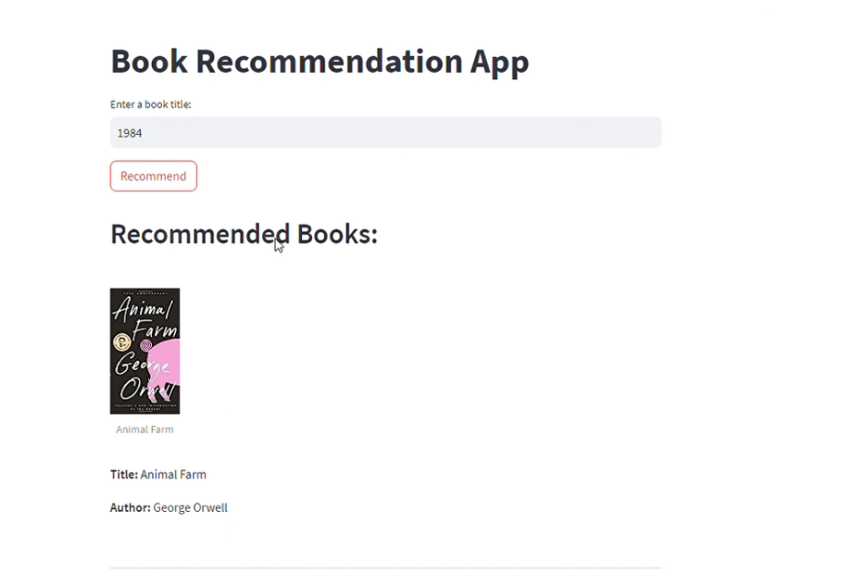

# Book Recommendation Web App

## Introduction

This is a book recommendation web app that allows users to discover new books based on their input book titles. The app uses collaborative filtering and cosine similarity to recommend books similar to the input book. It is powered by Streamlit and built with Python.

## Features

- Input a book title and get top book recommendations
- View book recommendations along with book cover images, author names, and URLs
